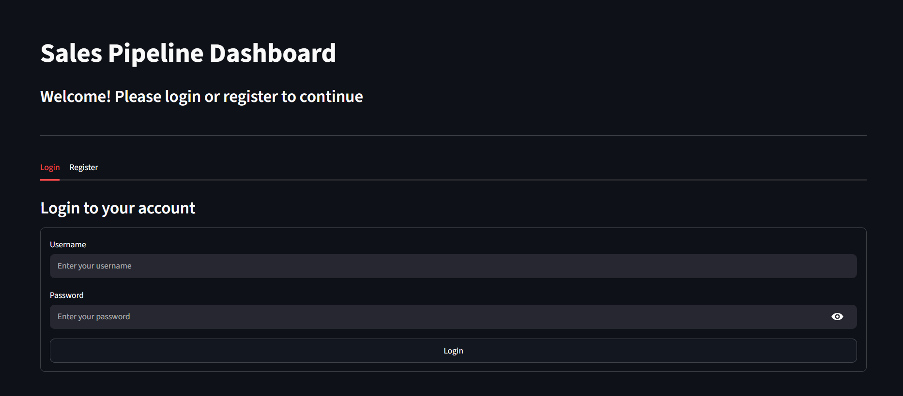
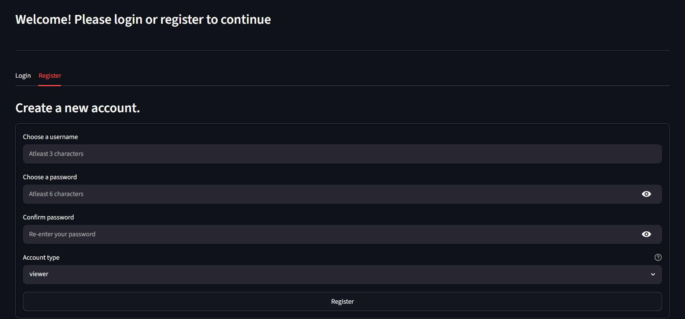
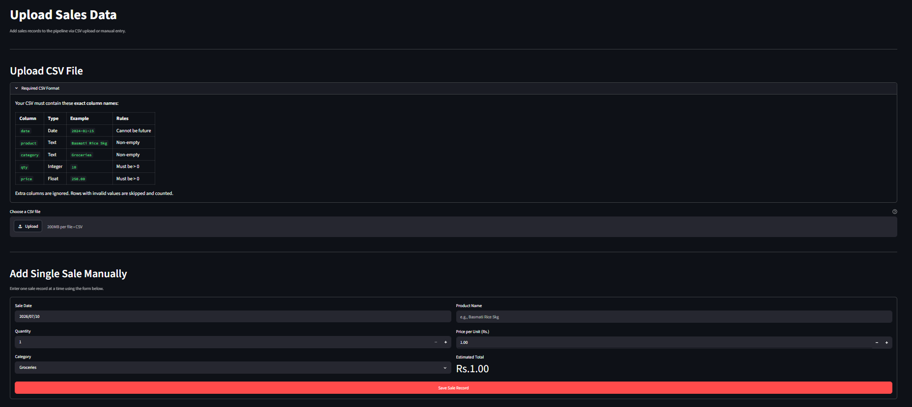
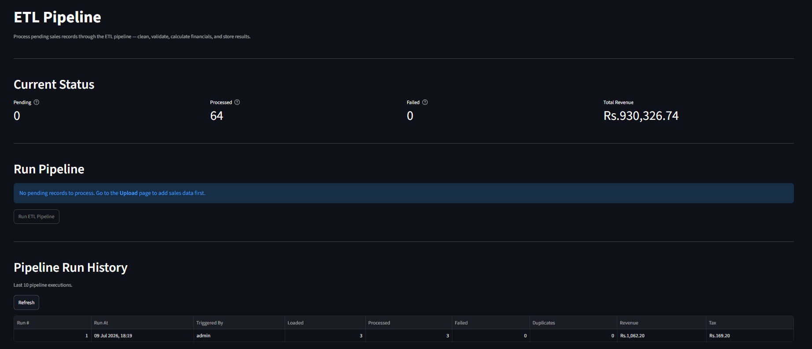
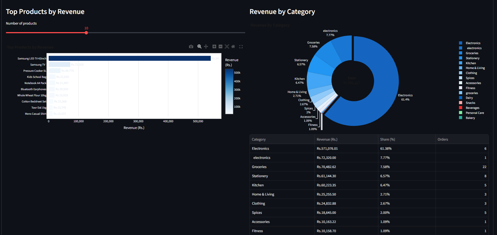
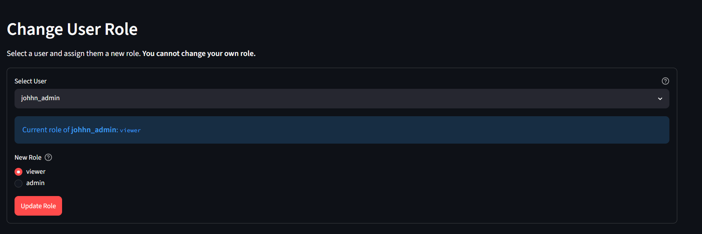

#  Sales Pipeline Dashboard

A full-stack **Retail Sales Analytics Dashboard** built with **FastAPI**, **Streamlit**, **SQLite**, and **Pandas**. The application allows users to upload sales data, process it through an ETL pipeline, and visualize business insights using an interactive dashboard.

---

##  Features

-  JWT Authentication
-  Role-Based Access Control (Admin & Viewer)
-  CSV Upload & Manual Sales Entry
-  ETL Pipeline (Extract, Transform, Load)
-  Interactive Dashboard
-  Revenue Trend Analysis
-  Top Products Analysis
-  Category-wise Revenue Breakdown
-  CSV Report Export
-  Pipeline Logging

---

##  Tech Stack

| Layer | Technology |
|--------|------------|
| Frontend | Streamlit |
| Backend | FastAPI |
| Database | SQLite + SQLAlchemy |
| Data Processing | Pandas, NumPy |
| Authentication | JWT, bcrypt |
| Visualization | Plotly, Matplotlib |
| HTTP Client | httpx |

---

##  Project Structure

```text
sales_pipeline/
│
├── backend/
│   ├── auth.py
│   ├── database.py
│   ├── models.py
│   ├── pipeline.py
│   └── main.py
│
├── frontend/
│   ├── app.py
│   ├── login.py
│   ├── upload.py
│   ├── pipeline.py
│   ├── dashboard.py
│   └── api_client.py
│
├── data/
│   ├── sales.db
│   ├── sample.csv
│   └── pipeline.log
│
├── seed.py
├── test_edge_cases.py
├── test_pipeline.py
├── requirements.txt
├── .env
└── readme.md
```

---

##  Installation

### Clone Repository

```bash
git clone https://github.com/soumikchandra-ai/Sales_Pipeline.git

cd sales_pipeline
```

### Create Virtual Environment

```bash
python -m venv venv
```

Windows

```bash
venv\Scripts\activate
```

Mac/Linux

```bash
source venv/bin/activate
```

### Install Dependencies

```bash
pip install -r requirements.txt
```

---

##  Environment Variables

Create a `.env` file in the root directory.

```env
DATABASE_URL=sqlite:///./data/sales.db
SECRET_KEY=your_secret_key
ALGORITHM=HS256
ACCESS_TOKEN_EXPIRE_MINUTES=60
API_BASE_URL=http://127.0.0.1:8000
TAX_RATE=0.18
DISCOUNT_RATE=0.05
```

---

##  Running the Application

### Start Backend

```bash
uvicorn backend.main:app --reload
```

Backend

```
http://127.0.0.1:8000
```

Swagger Docs

```
http://127.0.0.1:8000/docs
```

---

### Start Frontend

```bash
streamlit run frontend/app.py
```

Frontend

```
http://localhost:8501
```

---

##  ETL Pipeline

```
Upload Sales Data
        │
        ▼
Raw Sales Table
        │
        ▼
Validation & Cleaning
        │
        ▼
Transformation
        │
        ▼
Processed Sales Table
        │
        ▼
Analytics Dashboard
```

During processing the pipeline:

- Validates records
- Removes invalid entries
- Detects duplicates
- Calculates Tax
- Applies Discount
- Computes Final Amount
- Stores processed records

---

##  Dashboard

The dashboard provides:

- Total Revenue
- Total Orders
- Average Order Value
- Tax Collected
- Revenue Trend
- Top Selling Products
- Category Distribution
- Download Processed Data as CSV

---

##  User Roles

| Feature | Viewer | Admin |
|----------|:------:|:-----:|
| View Dashboard | ✅ | ✅ |
| View Sales | ✅ | ✅ |
| Upload CSV | ❌ | ✅ |
| Manual Entry | ❌ | ✅ |
| Run ETL Pipeline | ❌ | ✅ |
| Manage Users | ❌ | ✅ |

---

---

#  Application Screenshots

##  Login Page

Authenticate using JWT-based login.

<p align="center">
  
</p>

---

##  Registration Page

Create a new user account with role selection.

<p align="center">
  
</p>

---

##  Upload Sales Data

Upload sales records through CSV files or manually enter records.

<p align="center">
  
</p>

---

##  ETL Pipeline

Run the ETL pipeline to clean, validate, and transform uploaded data.

<p align="center">
  
</p>

---

##  Dashboard Overview

View key business metrics including revenue, orders, and average order value.

<p align="center">
  
</p>

---

##  Admin Panel

Manage users and role-based access.

<p align="center">
  
</p>

---

##  API Endpoints

### Authentication

```
POST /auth/register
POST /auth/login
GET  /auth/me
```

### Sales

```
POST /sales/upload-manual
POST /sales/upload-csv
GET  /sales/raw
GET  /sales/processed
```

### Pipeline

```
POST /pipeline/run
```

### Dashboard

```
GET /dashboard/summary
GET /dashboard/revenue-trend
GET /dashboard/top-products
GET /dashboard/category-breakdown
```

---
